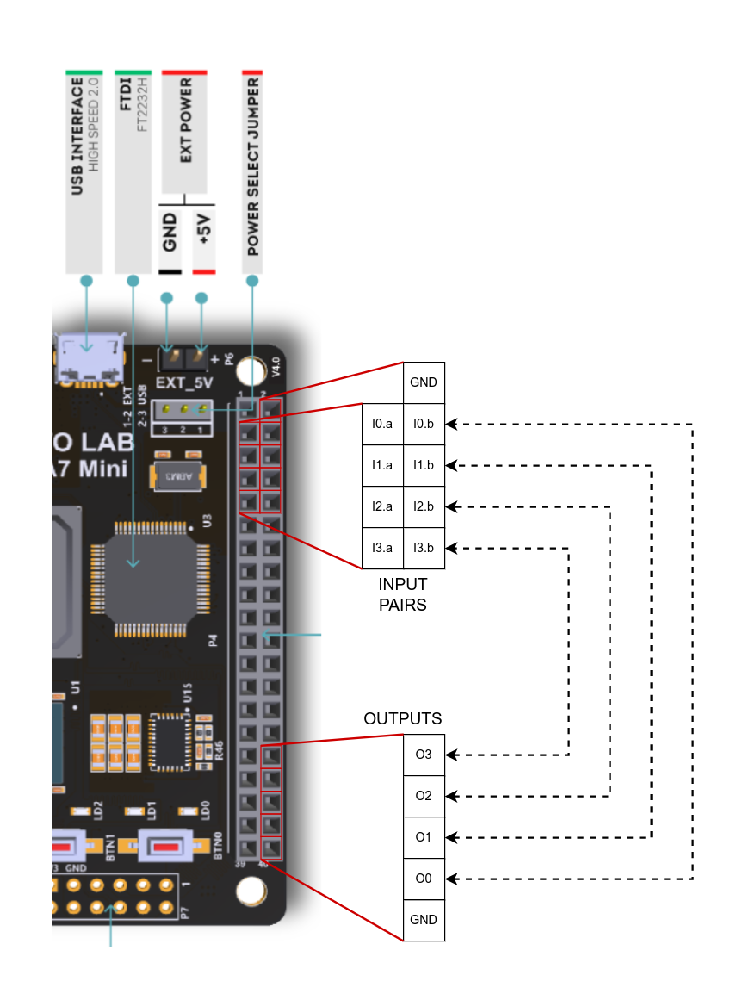
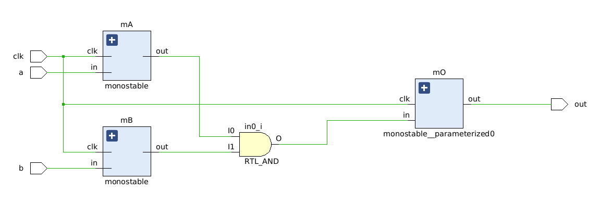

# Shoot-through detector 
# using FPGA

This repo contains the following folders:
 - fpga: fpga-specific code
 - rtl: synthesizable code
 - sim: simulation testbenches
 - vivado: IDE project file
 - openocd: openOCD configuration file and programming script

FPGA implementation is done using [Numato Mimas A7 Mini FPGA board](https://numato.com/product/mimas-a7-mini-fpga-development-board).

  

# Block Diagram
 
  

# How to use the shoot-through checker?
 Connect the wires to the output of the digital driver, a pair for each driver.
 I.e. "driver_high" to I0.a and "driver_low" to I0.b. Or viceversa, it doesn't matter. The detected shoot-through event is available for visualization with oscilloscope or logic analyzer on pin O0. Also, the LD0 will turn on for an indefinite anount of time to signal that a shoot-through occured. It can be cleared by pressing button BTN0. 

 The signalling LEDs are LD0, LD1, LD2, LD3 and the unique "clear" button is BTN0 which clears all four LED events.
 

## Implementation blocks
 monostable: 

 
 synchronizer: 

 
 flag: 

 
 detector: 

 
## Top View
 Single channel detection block:
 
 All four channels:
 
 
 
Original blog post [freeelectron.ro](https://freeelectron.ro/shoot-through-detector-using-fpga/)
 

